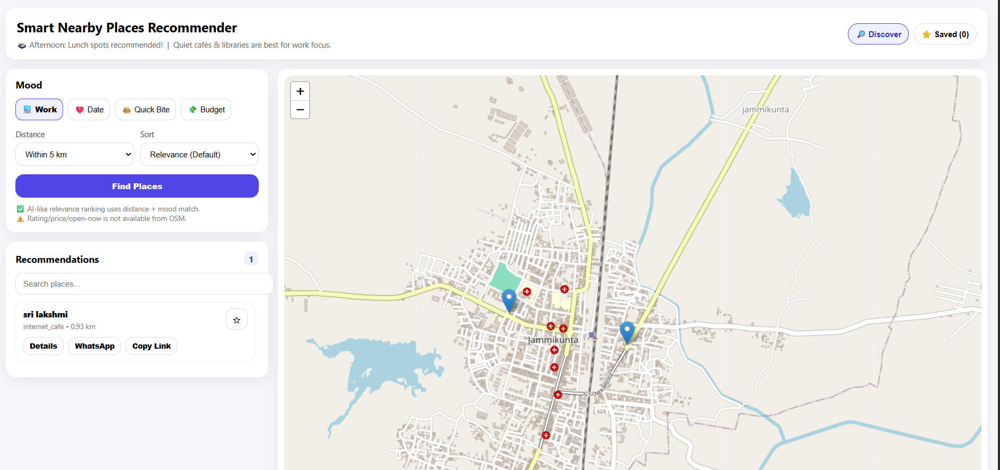
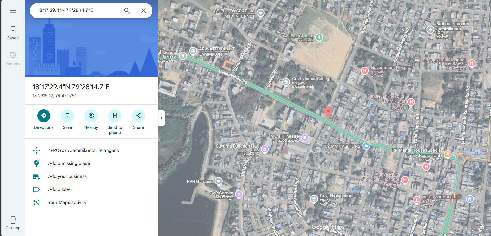

# Smart Nearby Places Recommender 🗺️

A location-based web application that recommends nearby places based on user mood using **OpenStreetMap + Overpass API**.  
Built with **React + Leaflet** and includes filters, sorting, favorites, offline caching and place details.

---

## 🚀 Features
- 📍 Real-time location detection (with fallback location)
- 😊 Mood-based place recommendations:
  - Work → cafés, libraries, coworking spaces
  - Date → restaurants, cafés, parks, theatres
  - Quick Bite → fast food, restaurants
  - Budget → budget-friendly eateries (best-effort)
- 🎯 "Top match for your mood" smart suggestion banner
- 🧭 Filters & Sorting:
  - Distance (1 / 3 / 5 / 10 / 20 km)
  - Sort by relevance / distance / A-Z
  - Search results by place name
- ⭐ Favorites / Saved Places tab (localStorage)
- 📌 Place details (modal page)
- 📤 Share on WhatsApp + copy link
- 📍 Directions button (opens Google Maps)
- 💾 Offline support: caches last search results

---

## 🛠️ Tech Stack
- React.js
- Leaflet + React Leaflet (OpenStreetMap tiles)
- Overpass API (place discovery)
- localStorage (favorites + offline cache)

---

## 📦 Installation & Run
```bash
npm install
npm start


## 📸 Screenshots

### Home


### Results


### Saved Places

